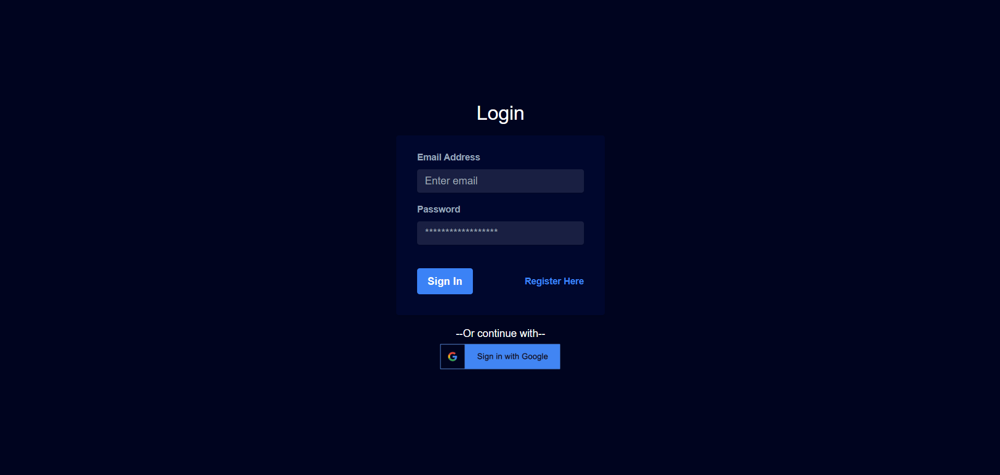
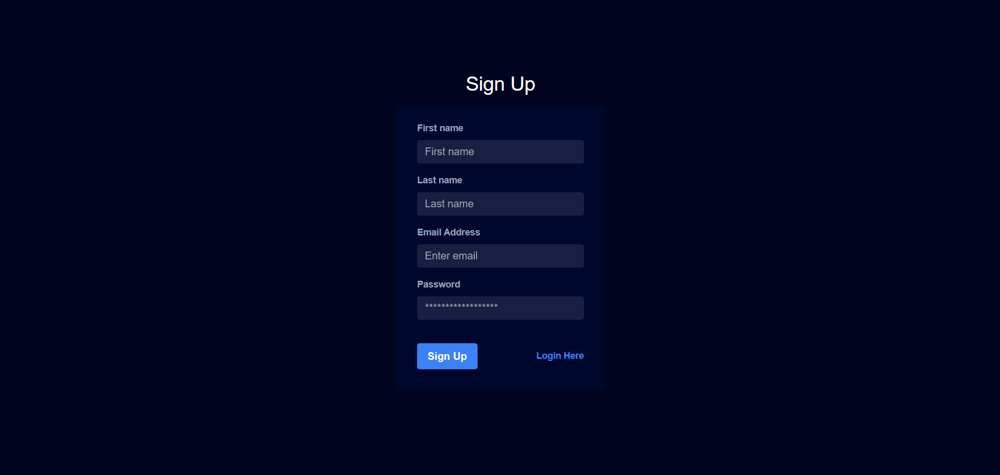
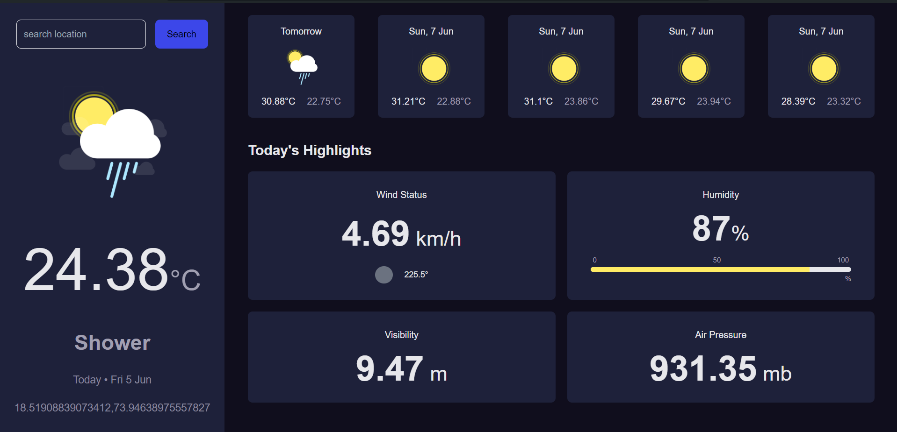

# React Weather App With Login / Sign Up

## Features 

1. Live Weather Data And Forcast data retrieved via an API from tommorow.io.
2. Weather Dashboard UI using Tailwind CSS
3. Loading Screen while data is being fetched from the  API
4. Proper Login Authentication using FireBase
5. User is remembered after login even after closing the app
6. Login Using Google.
7. User feedback through toastify on invalid input.

### Caution

1. On reloading too many times the weather dashboard will show default data as the api cant handle too many requests (cons of free version).

2. Once you logged in you don't need to login again again even after you restart the app.

## Photos of UI

1. Login Page



2. Register Page



3. Dashboard



### Run Project 

``` npm install ```

```npm run start```